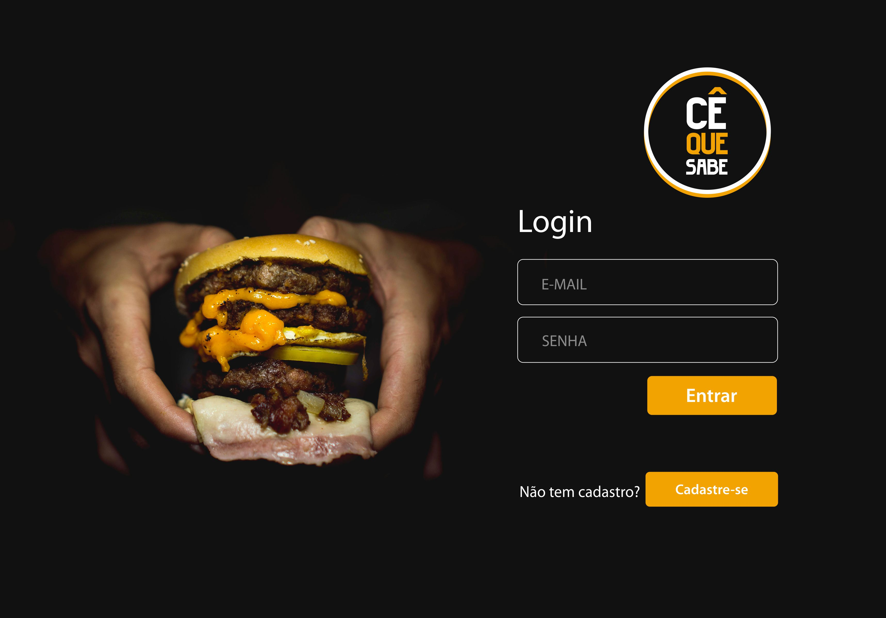
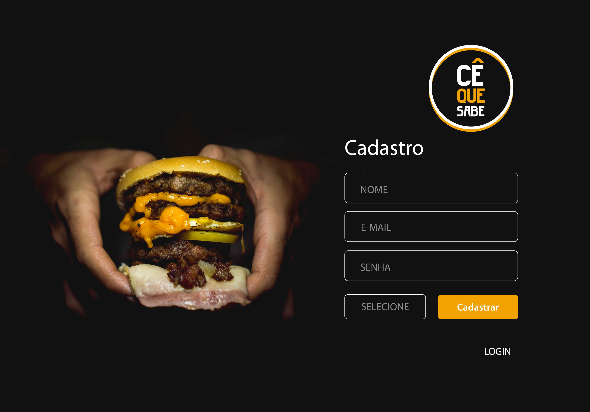
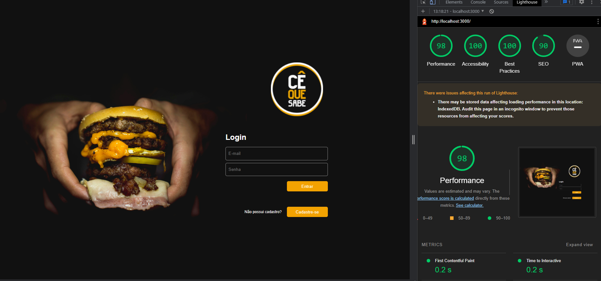
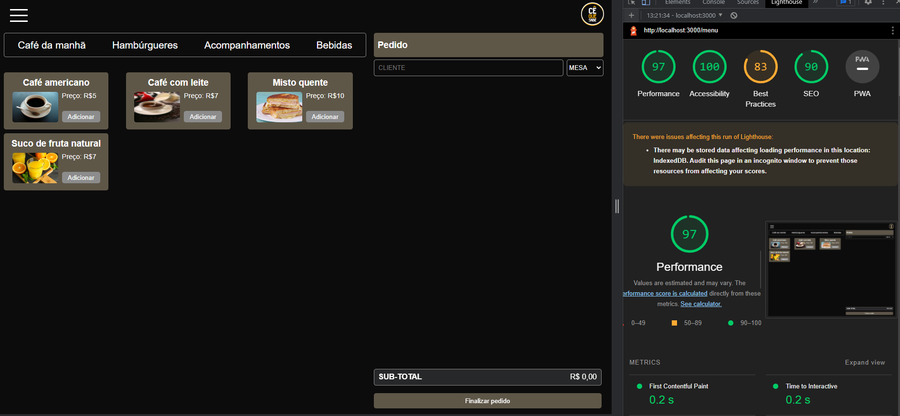
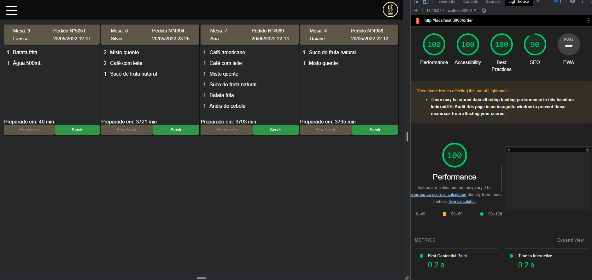

## SOBRE O PROJETO

Projeto realizado para uma pequena Hamburgueria, foi desenvolvido uma interface para ajudar no atendimento dos clientes, por meio de um tablet é retirado o pedido e enviado para a cozinha para que sejam preparados de forma ordenada e eficiente.

Este projeto tem duas áreas: interface (cliente) e API (servidor). Nosso cliente nos pediu para desenvolver uma interface que se integre com a [API](https://lab-api-bq.herokuapp.com/api-docs/).

Nós temos 2 menus.
Um muito simples para o café da manhã:

> | Ítem                           | Preço R$ |
> | ------------------------------ | -------- |
> | Café americano                 | 5        |
> | Café com leite                 | 7        |
> | Sanduíche de presunto e queijo | 10       |
> | Suco de fruta natural          | 7        |
>
> E outro menu para o resto do dia:
>
> | Ítem                     | Preço  |
> | ------------------------ | ------ |
> | **Hambúrgueres**         | **R$** |
> | Hambúrguer simples       | 10     |
> | Hambúrguer duplo         | 15     |
> | **Acompanhamentos**      | **R$** |
> | Batata frita             | 5      |
> | Anéis de cebola          | 5      |
> | **Bebidas**              | **R$** |
> | Água 500ml               | 5      |
> | Água 750ml               | 7      |
> | Bebida gaseificada 500ml | 7      |
> | Bebida gaseificada 750ml | 10     |
>
> **Importante:** Os clientes podem escolher entre hambúrgueres de carne bovina,
> frango ou vegetariano. Além disso, por um adicional de R\$ 1,00 , eles podem
> adicionar queijo **ou** ovo.

---

## HISTÓRIA DO USUARIO

- História de usuário 1- Garçom/Garçonete deve poder entrar no sistema

Eu, como garçom/garçonete quero entrar no sistema de pedidos.

- História de usuário 2- Garçom/Garçonete deve ser capaz de anotar o pedido do cliente

Eu como garçom/garçonete quero poder anotar o pedido de um cliente para não
depender da minha memória, saber quanto cobrar e poder enviar os pedidos para a
cozinha para serem preparados em ordem.

- História de usuário 3- Chefe de cozinha deve ver os pedidos

Eu como chefe de cozinha quero ver os pedidos dos clientes em ordem, poder
marcar que estão prontos e poder notificar os garçons/garçonetes que o pedido
está pronto para ser entregue ao cliente.

- História de usuário 4- Garçom/Garçonete deve ver os pedidos prontos para servir

Eu como garçom/garçonete quero ver os pedidos que estão prontos para entregá-los
rapidamente aos clientes.

---

## PROTÓTIPOS

## Paleta de cores

## FLUXOGRAMA

---

## TESTES

Os testes de unidade cobrem no mínimo 80% de statements, functions, lines e branches.

A aplicação segue 80% ou mais das pontuações de Performance, Progressive Web App, Accessibility e Best Practices do Lighthouse.

